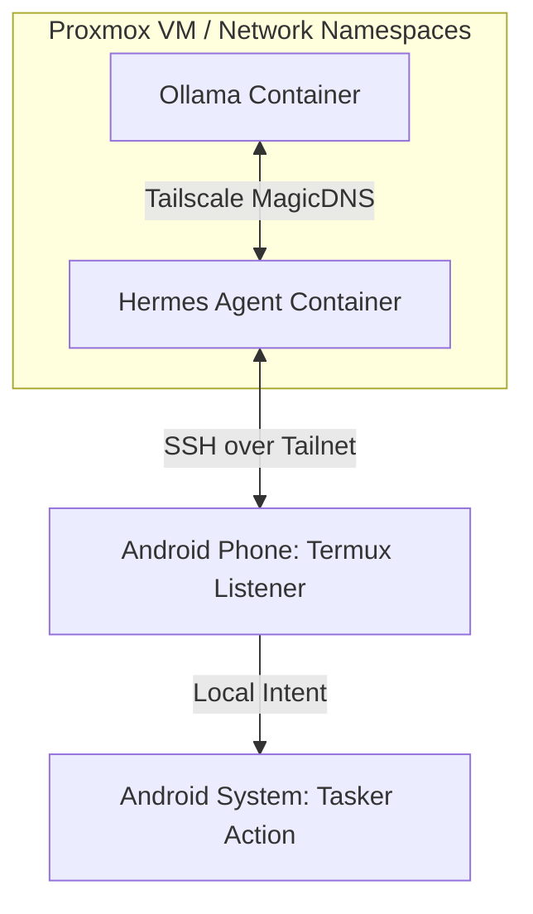

# Sovereign: Zero-Trust Local AI Pipeline

This repository defines a fully isolated, zero-trust automation pipeline that connects a locally hosted AI agent to physical mobile hardware. By utilizing Tailscale network namespaces, default-deny egress firewalls, and an encrypted SSH bridge via Termux, the AI agent can execute native Android system changes without exposing local ports, relying on public cloud webhooks, or routing through standard Docker host bridges.

## Logical Flow

The architecture enforces strict microsegmentation. The LLM and the Agent exist in entirely separate network namespaces and can only communicate via the encrypted WireGuard mesh.



## Infrastructure Code

This `docker-compose.yml` demonstrates the sidecar pattern used to strip host network access from the containers and force all traffic through the Tailnet.

```yaml
services:
  # Sidecar for LLM
  tailscale-ollama:
    image: tailscale/tailscale:latest
    hostname: node-ollama
    environment:
      - TS_AUTHKEY=${TS_AUTHKEY_OLLAMA}
      - TS_STATE_DIR=/var/lib/tailscale
    volumes:
      - tailscale-ollama-data:/var/lib/tailscale
      - /dev/net/tun:/dev/net/tun
    cap_add:
      - net_admin
      - sys_module

  ollama:
    image: ollama/ollama:latest
    network_mode: service:tailscale-ollama
    depends_on:
      - tailscale-ollama
    volumes:
      - ollama-models:/root/.ollama

  # Sidecar for Agent
  tailscale-hermes:
    image: tailscale/tailscale:latest
    hostname: node-hermes
    environment:
      - TS_AUTHKEY=${TS_AUTHKEY_HERMES}
      - TS_STATE_DIR=/var/lib/tailscale
    volumes:
      - tailscale-hermes-data:/var/lib/tailscale
      - /dev/net/tun:/dev/net/tun
    cap_add:
      - net_admin
      - sys_module

  hermes-agent:
    build: ./agent
    network_mode: service:tailscale-hermes
    depends_on:
      - tailscale-hermes
    volumes:
      - ./agent-data:/app/data

volumes:
  tailscale-ollama-data:
  ollama-models:
  tailscale-hermes-data:
```

## Future Extensibility: Secure Personal Data Integration

The primary advantage of this zero-trust architecture is how it handles future integration with highly sensitive personal data. 

Because the AI agent is trapped within a dedicated network namespace and secured behind a default-deny egress firewall, it physically cannot exfiltrate data to the public internet. This specific security boundary allows me to safely mount my private Obsidian markdown vault, local calendar files, and personal task lists directly into the agent's container. 

Moving forward, the agent will act as a fully private, locally executed orchestrator—reading my daily Obsidian notes and schedule, parsing the context natively via Ollama, and automatically dispatching environmental changes to my phone over the Tailnet, all while mathematically guaranteeing my data never leaves my hardware.
