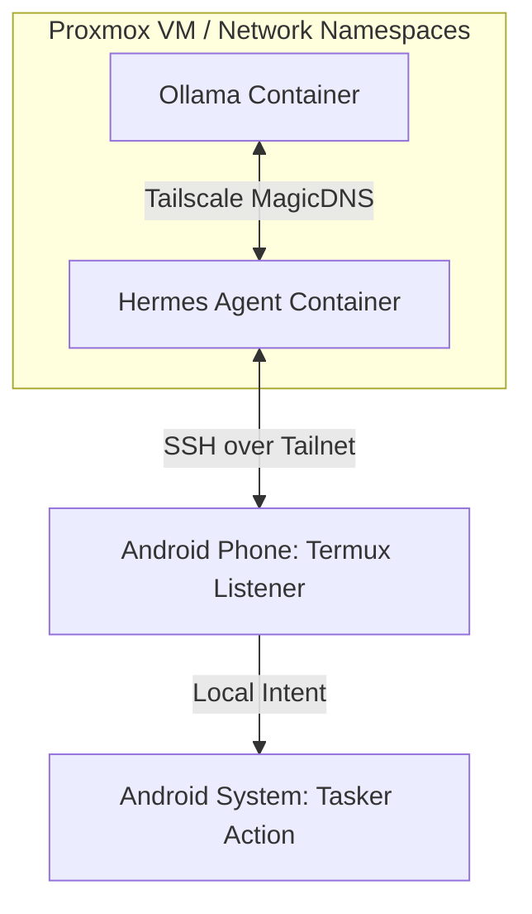

# Sovereign: Zero-Trust Local AI Pipeline

This repository defines a fully isolated, zero-trust automation pipeline that connects a locally hosted AI agent to physical mobile hardware. By utilizing Tailscale network namespaces, default-deny egress firewalls, and an encrypted SSH bridge via Termux, the AI agent can execute native Android system changes without exposing local ports, relying on public cloud webhooks, or routing through standard Docker host bridges.

## Logical Flow

The architecture enforces strict microsegmentation. The LLM and the Agent exist in entirely separate network namespaces and can only communicate via the encrypted WireGuard mesh.



## Infrastructure Code

This `docker-compose.yml` demonstrates the sidecar pattern used to strip host network access from the containers and force all traffic through the Tailnet.

```yaml
services:
  tailscale-ollama:
    image: tailscale/tailscale:latest
    container_name: tailscale-ollama
    hostname: ollama-node
    environment:
      - TS_AUTHKEY=${TS_AUTHKEY}
      - TS_STATE_DIR=/var/lib/tailscale
      - TS_USERSPACE=false
      - TS_ACCEPT_DNS=true
    volumes:
      - tailscale_ollama_state:/var/lib/tailscale
      - /dev/net/tun:/dev/net/tun
    cap_add:
      - NET_ADMIN
      - SYS_MODULE
    restart: unless-stopped
    healthcheck:
      test: ["CMD", "tailscale", "status", "--active"]
      interval: 5s
      timeout: 5s
      retries: 5

  ollama:
    image: ollama/ollama:latest // I should probably change this to decrease the chances of supply chain attack
    container_name: ollama-node-app
    network_mode: service:tailscale-ollama
    environment:
      - OLLAMA_HOST=0.0.0.0
      - OLLAMA_FLASH_ATTENTION=1
      - OLLAMA_KV_CACHE_TYPE=q4_0
    volumes:
      - ollama_data:/root/.ollama
    depends_on:
      tailscale-ollama:
        condition: service_healthy
    restart: unless-stopped

  tailscale-sidecar:
    image: tailscale/tailscale:latest
    container_name: tailscale-sidecar
    hostname: hermes-node
    environment:
      - TS_AUTHKEY=${TS_AUTHKEY}
      - TS_STATE_DIR=/var/lib/tailscale
      - TS_USERSPACE=false
      - TS_ACCEPT_DNS=true
    volumes:
      - tailscale_hermes_state:/var/lib/tailscale
      - /dev/net/tun:/dev/net/tun
    cap_add:
      - NET_ADMIN
      - SYS_MODULE
    restart: unless-stopped
    healthcheck:
      test: ["CMD", "tailscale", "status", "--active"]
      interval: 5s
      timeout: 5s
      retries: 5

  sovereign-hermes:
    image: nousresearch/hermes-agent:latest
    container_name: sovereign-hermes
    restart: unless-stopped
    command: gateway run
    network_mode: service:tailscale-sidecar
    environment:
      - HERMES_HOME=/opt/data
      - API_SERVER_ENABLED=true
      - API_SERVER_HOST=0.0.0.0
      - API_SERVER_PORT=8642
      - OLLAMA_BASE_URL=http://ollama-node.${TAILNET_NAME}.ts.net:11434
      - API_SERVER_KEY=${API_SERVER_KEY}
      - HERMES_DASHBOARD=1
      - HERMES_DASHBOARD_HOST=0.0.0.0
      - HERMES_DASHBOARD_PORT=9119
    volumes:
      - ./hermes-data:/opt/data
    depends_on:
      tailscale-sidecar:
        condition: service_healthy
      ollama:
        condition: service_started

volumes:
  tailscale_ollama_state:
  tailscale_hermes_state:
  ollama_data:
```

## Quick Start

1. Clone the repository:
   ```bash
   git clone https://github.com/YOUR_USERNAME/sovereign-agent-infrastructure.git
   cd sovereign-agent-infrastructure
   ```

2. Configure your environment variables:
   ```bash
   cp .env.example .env
   nano .env
   ```
   *(Fill in your Tailscale Auth Key, API key, and Tailnet name).*

3. Deploy the stack:
   ```bash
   docker-compose up -d
   ```

4. Verify container health:
   ```bash
   docker ps --format "table {{.Names}}\t{{.Status}}\t{{.Ports}}"
   ```

## Live Implementation

The core architecture is deployed on the host environment. Below is the operational output from a live verification test:

**Container Status:**

```text
NAMES                 STATUS                 PORTS
tailscale-ollama      Up 2 hours (healthy)        
ollama-node-app       Up 2 hours (healthy)        
tailscale-sidecar     Up 2 hours (healthy)        
sovereign-hermes      Up 2 hours (healthy)        
```

**End-to-End Mock Test (LLM to Agent to Intent):**

```text
$ python3 src/agent/orchestrator.py
What do you want to do? Turn on silent mode
LLM says: silent
[AGENT] Sending intent code 3 to Android...
==================================================
[MOCK ANDROID] Received intent: 3
Action: Silent Mode ENABLED
==================================================
```

## Future Extensibility: Secure Personal Data Integration

The primary advantage of this zero-trust architecture is how it handles future integration with highly sensitive personal data.

Because the AI agent is trapped within a dedicated network namespace and secured behind a default-deny egress firewall, it physically cannot exfiltrate data to the public internet. This specific security boundary allows safely mounting a private Obsidian markdown vault, local calendar files, and personal task lists directly into the agent's container.

Moving forward, the agent will act as a fully private, locally executed orchestrator—reading daily notes and schedule, parsing the context natively via Ollama, and automatically dispatching environmental changes over the Tailnet.
